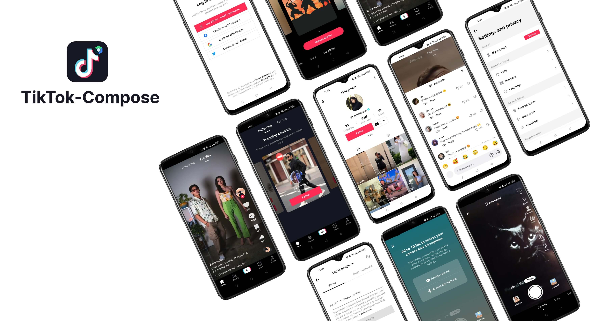
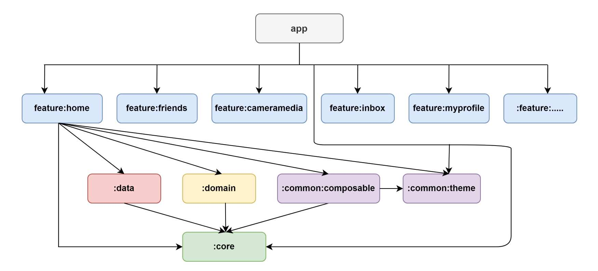

# TikTok-Compose

TikTok clone app built with Jetpack Compose following latest modern android development trend. Data shown in the app is from local data source, you can replace that with your own server api.

 

Click download button to get latest TikTok compose app

 

## TechStack
- [Jetpack Compose](https://developer.android.com/jetpack/compose)
- [Material 3](https://m3.material.io/)
- [Coroutine](https://kotlinlang.org/docs/coroutines-overview.html)
- [Accompanist](https://google.github.io/accompanist/)
- [Hilt](https://dagger.dev/hilt/)
- [Coil](https://coil-kt.github.io/coil/)
- [Multi Module](https://developer.android.com/topic/modularization)
- [Kotlin DSL](https://docs.gradle.org/current/userguide/kotlin_dsl.html)
- [Media 3](https://developer.android.com/guide/topics/media/media3)
- [CameraX](https://developer.android.com/training/camerax) and so on

 

## Architecture
- Clean Architecture
- MVVM
- UDF (Unidirectional Data Flow)

 

## Modularization
To achieve low coupling, and high cohesion with maximum reusability & scalable code base, this project is modularized.
This app consists of the following modules:

- app
- feature
- data
- domain
- common
- core

 

## Contribution
You are always welcome to contribute to this project. For contributing, feel free to [create an issue](https://github.com/puskal-khadka/TikTok-Compose/issues/new/choose) or submit a pull request.

 
